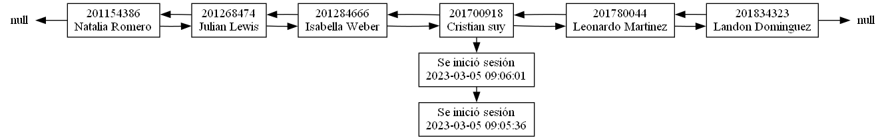
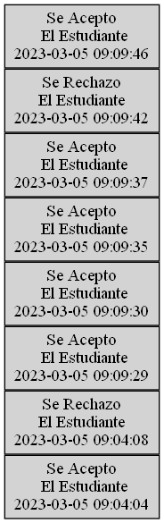

# Estructura de Datos Proyecto 1 

Panel de administracion de usuarios de la aplicacion
EDD GoDrive

## Description

Aplicacion que permite al administrador la carga
en diferentes estructuras de datos de estudiantes
de Ingenieria para su posterior utilizacion

## Requisitos

### Minimos

* Compilador de Go instalado 1.20.1 o posteriores
* Windows 7,10 o 11
* Graphviz version 7.1.0 (20230121.1956)

### Ejecucion del Programa

1. Colocarnos en la ruta del archivo main

```
cd ruta/de/el/main
```

2. Ejecutar el comando run del compilador de GO
```
go run .
```

## Conocimientos
Punteros manejo de memoria dinamica y estatica
aplicada a estructuras de datos

* Programacion Orientada a Objetos 
* Sintaxis Go
* JSON (Java Script Object Notation)
##
* Listas


## 
* Colas


##
* Pilas



## Diagrama de Clases


## Autor

- [@walterjav19](https://www.github.com/walterjav19)